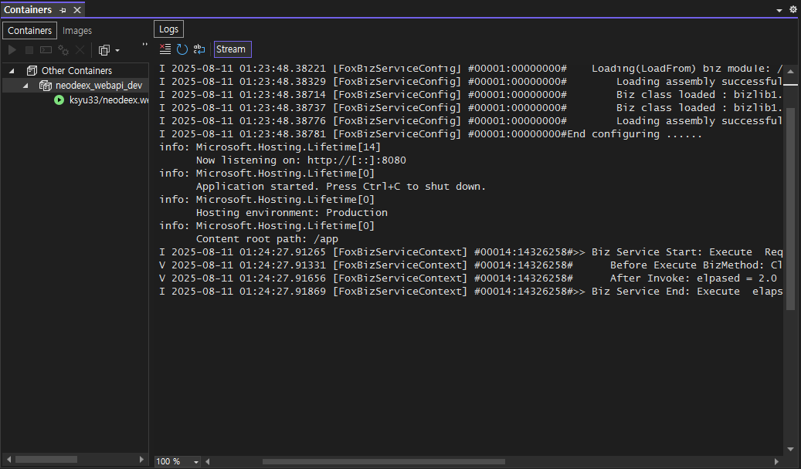
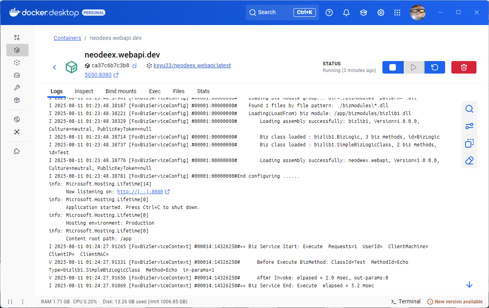
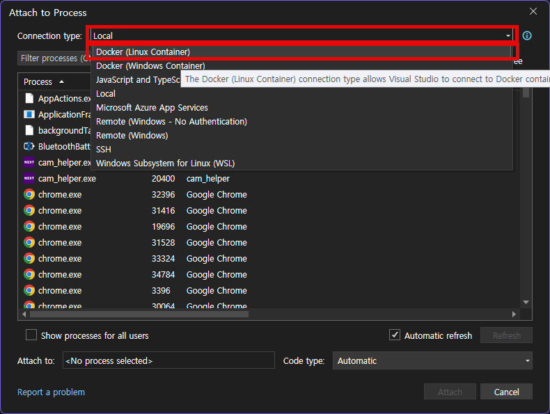
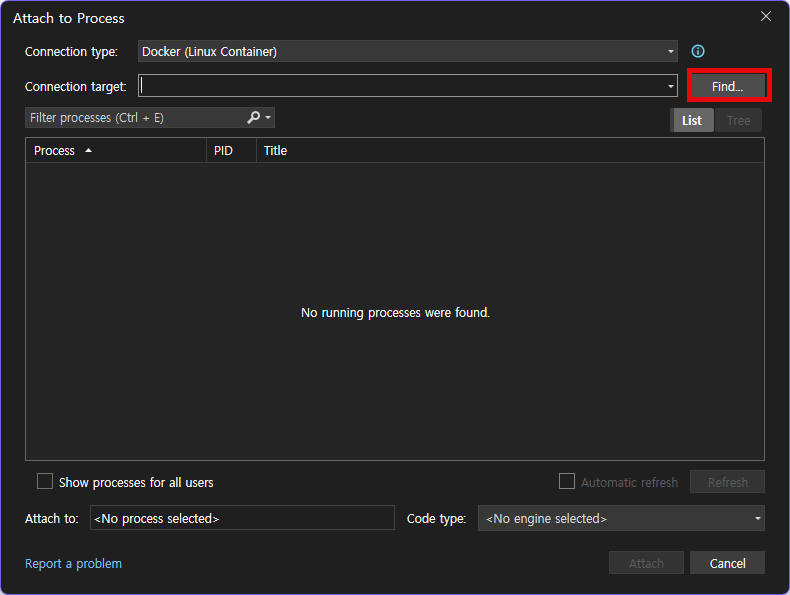
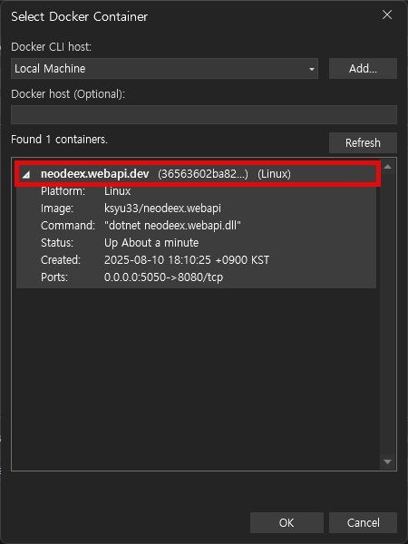
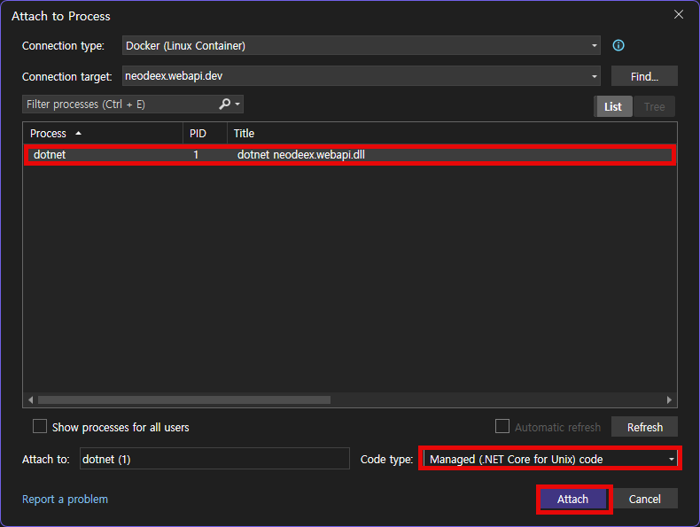

# NeoDEEX Fox Biz/Data Service WebApi 개발 박스

도커 허브의 [neodeex.webapi](https://hub.docker.com/r/ksyu33/neodeex.webapi) 이미지를 사용하여 Fox Biz/Data Service Web API 개발 환경을 사용하는 예제 입니다. `neodeex.webapi` 이미지에 대한 상세한 내용은 [별도의 문서](imageinfo.md)를 참고하십시요.

## Usage

1. 데이터베이스 연결 설정

    [`/config` 디렉터리의 `neodeex.config.json` 파일](./config/neodeex.config.json)을 편집하여 접속하고자 하는 데이터베이스 연결 문자열을 구성합니다. 다음은 SQL Server LocalDB 에 접속하는 설정의 예를 보여 줍니다.

    ```json
    {
      "$schema": "https://neodeex.github.io/doc/neodeex.config.schema.json",
      "$baseConfig": "neodeex.base.config.json",
      "database": {
        "connectionStrings": {
          "DefaultDB": {
            "connectionString": "Data Source=(LocalDB)\\MSSQLLocalDB;Database=Northwind;Integrated Security=True",
            "type": "NeoDEEX.Data.SqlClient.FoxSqlDbAccess"
          }
        }
      }
    }
    ```

    >[!NOTE]
    > 이 예제에 포함된 [`neodeex.config.json`](/config/neodeex.config.json) 파일은 [user-secrets](https://learn.microsoft.com/en-us/aspnet/core/security/app-secrets?view=aspnetcore-8.0&tabs=windows) 를 사용하여 연결 문자열을 읽어들입니다. 따라서 연결 문자열 값이 user-secrets 설정의 경로이며, `userSecrets` 속성이 `true` 로 지정되어 있습니다. 또한, `docker-compose.yml` 파일에서 로컬 호스트의 user-secrets 파일을 사용할 수 있도록 `mount` 설정도 추가되어 있습니다.

2. Foxml 쿼리 설정

    [`/foxml` 디렉터리](/foxml/)에 사용하고자 하는 `.foxml` 파일(들)을 작성합니다.

3. Biz 로직 모듈 (옵션)

    비즈 로직 모듈 `.dll` (들)을 작성하고 빌드된 `.dll` 을 [`/bizmodules` 디렉터리](/bizmodules/)에 복사합니다.

    > [!NOTE]
    > 이 예제에 포함된 bizlib1 프로젝트는 작성된 비즈 모듈 `dll` 을 `bizmodules` 디렉터리에 복사하는 빌드 이벤트를 포함하고 있습니다. 따라서 빌드가 수행되면 비즈 모듈이 자동으로 복사됩니다.

4. Docker Compose 를 구동하여 컨테이너를 구동합니다.

    ```cmd
    docker compose up
    ```

5. Fox Data Service Web API 에 대한 테스트 페이지를 이용하여 Foxml 쿼리 테스트를 수행합니다.

    ```url
    http://localhost:5050/api/dataservice/test
    ```

    로그는 콘솔에 로그로 출력되며 -d 옵션으로 컨테이너를 구동한 경우 다음 docker logs 명령을 사용할 수도 있습니다. 로그는 Visual Studio 의 Containers 창이나

    

    Docker Desktop 의 Logs 창에서도 확인할 수 있습니다.

    

6. Fox Biz Service Web API 에 대한 테스트 페이지를 이용하여 비즈 로직 호출 테스트를 수행합니다.

    ```url
    http://localhost:5050/api/bizservice/test
    ```

7. `.foxml` 파일 혹은 비즈 로직 모듈 `.dll` 파일이 변경된 경우 컨테이너를 재시작합니다.

    ```cmd
    docker compose restart
    ```

## Auto-Reload

비즈 모듈 `.dll` 이 변경되면 컨테이너를 자동으로 재시작 하도록 하거나, `.foxml` 파일의 변경을 감지하여 다시 로드하도록 설정이 가능합니다. 이 기능은 [Docker Compose 의 Watch 기능](https://docs.docker.com/compose/how-tos/file-watch/)을 사용해야 합니다.

> [!NOTE]
> Docker 를 사용하지 않고 Windows 환경에서 Web API 를 작성하는 경우, 비즈 로직 `dll` 파일이나 `.foxml` 파일 변경 시 다시 로드하는 기능은 NeoDEEX 수준에서 제공됩니다. 하지만 Docker 환경의 제약 사항으로 인해 Compose Watch 기능에 의존합니다.

다음은 Compose Watch 기능을 활용하여 비즈 모듈과 `.foxml` 파일 변경을 확인하는 `docker-compose.yml` 파일의 부분을 보여줍니다.

> [!CAUTION]
> `foxml` 과 `bizmodules` 디렉터리에 대한 `mount` 설정을 제거하고 `watch` 설정을 추가하십시요.

```yml
    develop:
      watch:
        # Foxml 디렉터리 변경 사항을 컨테이너에 동기화
        - action: sync
          path: ./foxml
          target: /app/foxml
          x-initialSync: true
        # 비즈 모듈 디렉터리 변경 사항을 컨테이너에 동기화
        - action: sync+restart
          path: ./bizmodules
          target: /app/bizmodules
          x-initialSync: true
```

> [!WARNING]
> Watch 기능이 정상적으로 작동하기 위해서는 `.dll` 파일 혹은 `.foxml` 파일의 수정 날짜가 `neodeex.webapi` 이미지의 생성 날짜보다 더 최신이어야 합니다. Watch 기능이 정상적으로 작동하지 않는다면 `bizmodules` 디렉터리와 `foxml` 디렉터리의 파일들의 수정 날짜를 확인하십시요. 그리고 필요다하면 이들 파일들의 날짜를 최신으로 바꾸는 PowerShell 스크립트(`touch-all.ps1`)를 사용하십시요.

`neodeex.config.json` 파일 역시 Watch 에 의해 변경 시 컨테이너를 다시 시작할 수 있지만 도커가 이 파일의 변경을 인식하는 것과 재시작하는 것의 타이밍 상의 문제로 잘 적용이 안될 수 있습니다. 따라서 구성 설정 파일은 Compose Watch 기능에 의존지 않고 명시적으로 컨테이너틀 다시 시작(`docker compose restart`)하는 것이 좋습니다.

Compose Watch 기능을 설정한 경우 `--watch` 옵션을 사용하여 Compose 를 수행하거나

```cmd
docker compose up --watch
```

컨테이너가 이미 구동 중이라면 `watch` 명령을 사용하십시요.

```cmd
docker compose watch
```

> [!NOTE]
> Compose Watch 를 사용하면(`--watch` 옵션 혹은 `watch` 명령) 명령을 수행한 터미널은 Compose Watch 모니터링 내용을 출력하며 제어를 반환하지 않습니다. 따라서 Compose Watch 를 위한 별도의 터미널을 여는 것이 편리 합니다.

## Configuration Customizing

Fox Biz/Data Service Web API 에 대한 구성 설정은 `/app/config/neodeex.config.json` 파일을 사용하도록 설정되어 있습니다. 그리고 `neodeex.config.json` 구성 설정은 베이스 구성 설정으로 `neodex.webapi` 이미지 내에 존재하는 `/app/neodeex.base.config.json` 파일을 사용합니다. 즉, `neodeex.base.config.json` 파일의 기본 구성 설정을 `neodeex.config.json` 설정으로 오버라이드 하는 것입니다.

```json
{
  ...
  "$baseConfig" : "neodeex.base.config.json"
  ...
}
```

`neodeex.bse.config.json` 에 설정된 기본 구성 설정에 대해서는 [이미지 정보 문서](ImageInfo.md)를 참고 하십시요.

기본 구성 설정을 오버라이는 하기 위해서는 마운트된 `config` 디렉터리의 `neodeex.config.json` 파일에 오버라이드하고자 하는 항목을 명시하면 됩니다. 예를 들어, 비즈/데이터 서비스가 반환하는 JSON 에 타입 정보를 포함시키고자 한다면 `neodeex.config.json` 파일에 다음 항목을 추가하면 됩니다.

```json
{
  ...
  "webapiServer": {
    "useTypeInfo": true
  }
}
```

위와 같은 설정은 `neodeex.base.config.json` 파일의 설정을 오버라이드(혹은 추가) 하게 됩니다.

> [!NOTE]
> 만약 `$baseConfig` 속성을 사용하지 않는다면 `neodeex.base.config.json` 파일의 내용은 전혀 참조되지 않고 `neodeex.config.json` 파일의 내용만이 구성 설정으로 사용됩니다.

## Debugging Biz Module

Visual Studio 를 이용하면 컨테이너에서 작동 중인 비즈 모듈에 대한 디버깅이 가능합니다. 구체적인 방법은 다음과 같습니다.

1. Debug 메뉴의 Attach Process 를 선택합니다.

2. Attach to Process 대화 상자에서 `Connection Type` 을 `Docker (Linux Container)` 으로 설정합니다.

    

3. Find 버튼을 클릭하여 Select Docker Container 대화 상자를 불러옵니다.

    

4. 로컬 컴퓨터에서 수행 중인 컨테이너들 중에서 디버깅 대상이 되는 컨테이너를 선택하고 OK 버튼을 클릭합니다. 이 예제의 경우 `neodeex.webapi.dev` 입니다.

    

5. 컨테이너에서 수행중인 프로세스 목록 중에서 타이틀이 `dotnet neodeex.webapi.dll` 인 프로세스를 선택하고 Attach

     버튼을 클릭합니다.

6. 디버그 어댑터가 구동된다는 메시지 표시 이후 디버거가 컨테이너에 연결되고 디버깅이 가능해 집니다.

    > [!NOTE]
    > 최초에 컨테이너에 디버거가 연결될 때까지 상당한 시간이 소요될 수 있습니다. 이는 Visual Studio 가 컨테이너에 리눅스용 원격 디버거(vsdbg)를 다운로드하고 설치하기 때문입니다. 수백 MB 가 넘는 크기이므로 인터넷 다운로드 상황에 따라서 수십 초 혹은 수 분 이상이 소요될 수 있습니다. 최초로 컨테이너에 원격 디버거가 설치된 이후에는 Attach Process 과정이 빠르게 수행됩니다.

## Other Consideration

---
